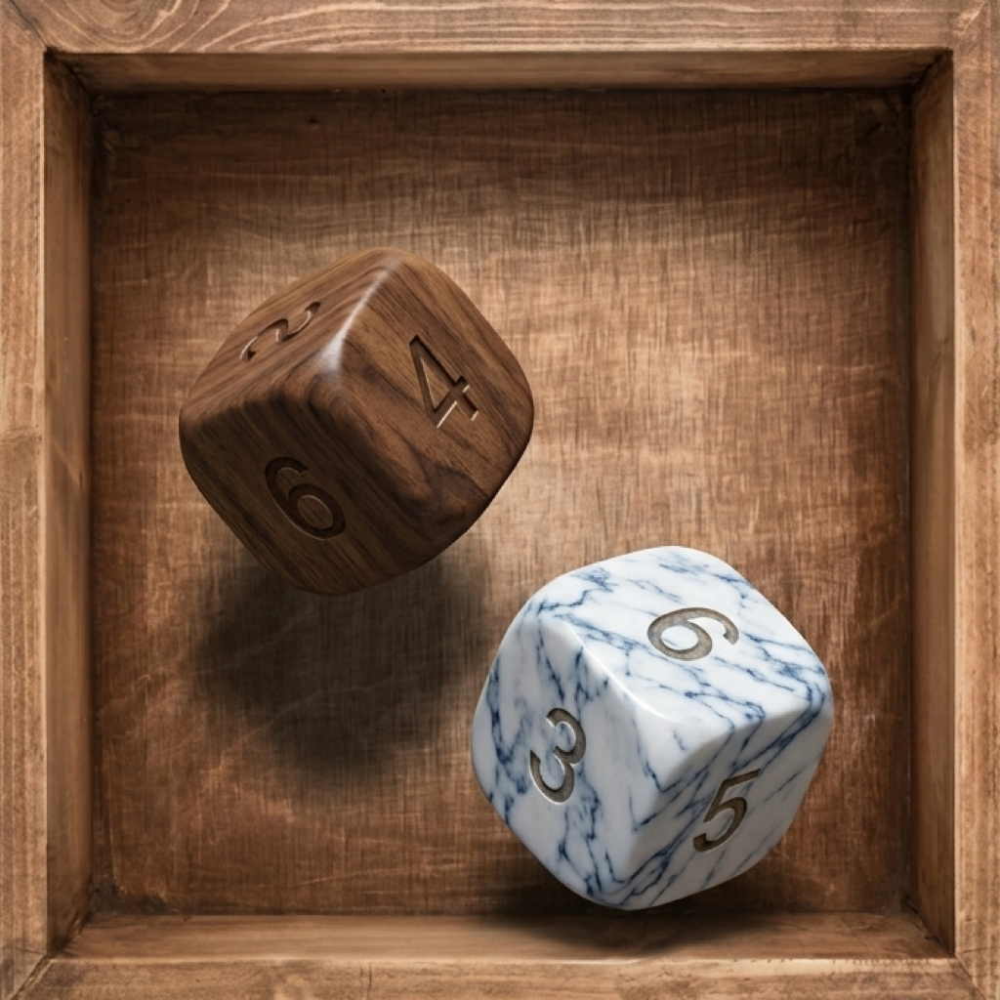

# Dice Throw



**Dice Throw** is a native iOS app that turns your phone into a real dice tray. Drop
in any mix of coins, d4s, d6s, d8s, d10s, d12s and d20s, tap or shake to throw, and watch
them tumble and settle with real physics, realistic shadows, and satisfying sound —
all rendered in 3D on a photographed wooden box background.

<br clear="left">

## Screenshots

| Home | Dice picker | Live throw | Results |
|---|---|---|---|
|  |  |  |  |

## Why you'll like it

- **Feels like real dice.** SceneKit physics (gravity, friction, restitution, wall/floor
  collisions) drives every roll, so no two throws land the same way, and dice cast real
  contact shadows so you can always tell how high they're bouncing.
- **Looks like a real dice tray.** A photographed wooden box frames the table, and every
  die is finished in a real material — marble, brushed steel, copper, gold, wood — instead
  of flat game-art colors.
- **Sounds like real dice.** Each die gets a fixed, believable sound budget per throw
  (one knock on first contact, a few more while it settles) instead of a noisy clatter
  on every bounce, plus a distinct coin-toss sound for the coin.
- **Answers "what can I even roll?" instantly.** The stats box shows the mean, minimum,
  and maximum possible total for your current pool the moment you add or remove a die —
  no need to throw first to find out.
- **Remembers your rolls.** Every throw is saved automatically; the History tab charts
  your recent totals and lists each throw's individual dice, its own mean/min/max, and
  its total.

## Features

- Mix and match seven die types: coin, d4, d6, d8, d10, d12, d20 (up to 10 dice in a pool)
- Tap the felt, tap a die, shake the phone, or drag-and-flick a held die to throw
- Long-press a die to pick it up, aim, and throw it in a specific direction — or drag
  it off the table to remove it
- Real-time MEAN / MIN / MAX readout for the current dice pool, docked to the screen edge
- Rolling 7-throw results strip that slides new totals in as you throw
- Linear-deceleration count-up animation with a flash on the final total
- Full throw history with a scrollable bar chart, per-throw dice breakdown, and
  per-throw mean/min/max
- Procedurally generated 3D dice with beveled edges and real material textures, plus a
  recorded coin-toss sound effect
- Settings for sound, haptics, shake-to-throw, and shake sensitivity
- Built with SwiftUI, SceneKit and SwiftData; Firebase Analytics is the only dependency

## Tech stack

- Swift & SwiftUI, iOS 17.0 minimum deployment target
- SceneKit for 3D rendering and physics simulation
- SwiftData for persisted throw history
- AVAudioEngine for procedural impact sounds and a recorded coin-toss clip
- Firebase Analytics via `FirebaseAnalyticsCore` — the variant with no IDFA/AdSupport
  access, so the app needs no App Tracking Transparency prompt
- Procedurally generated dice geometry (`DiceGeometry.swift`) with per-face value
  reading from each die's physical resting orientation

## Building

The Firebase config is **not** committed — `DiceThrow/GoogleService-Info.plist` is
gitignored because this repo is public. To build with analytics, create your own
Firebase iOS app for bundle id `com.ozsoffy.DiceThrow`, download its
`GoogleService-Info.plist`, and drop it in `DiceThrow/`.

Without that file the app still builds and runs — `DiceThrowApp` skips
`FirebaseApp.configure()` when it's missing, so analytics is simply off.

The 3D dice models are generated, not hand-authored. To regenerate them after
changing `Tools/GenerateDiceModels.swift`:

```
swift Tools/GenerateDiceModels.swift DiceThrow/DiceModels
```

## Project structure

```
DiceThrow/
  DiceThrowApp.swift      App entry point, SwiftData container
  ContentView.swift        Main screen: HUD, controls, throw/pool state
  DiceTable.swift           SceneKit scene, physics, contact sounds
  DiceTableView.swift       UIViewRepresentable wrapper + gesture handling
  DiceGeometry.swift        Procedural dice meshes, face-value reading
  Models.swift               DieType, PooledDie, ThrowResult (SwiftData)
  Analytics.swift            Firebase event + user-property taxonomy, in one place
  SoundSynth.swift            Procedural + recorded audio playback
  HistoryView.swift           Throw history chart + per-throw breakdown
  SettingsView.swift          Sound/haptics/shake settings
  ShakeMonitor.swift          Shake-to-throw motion detection
  DiceModels/                 USD dice models + material textures
  BoxModel/                   USD box model
  Assets.xcassets/             App icon, launch image, wood box texture
  PrivacyInfo.xcprivacy        Required-reason API + collected-data declarations
Marketing/
  Screenshots/                 App Store-ready screenshots (1242x2688)
```
